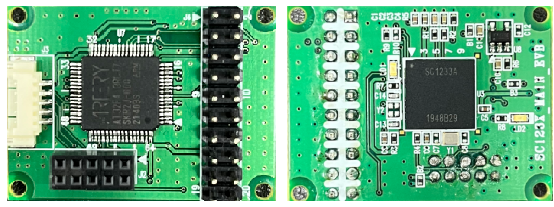
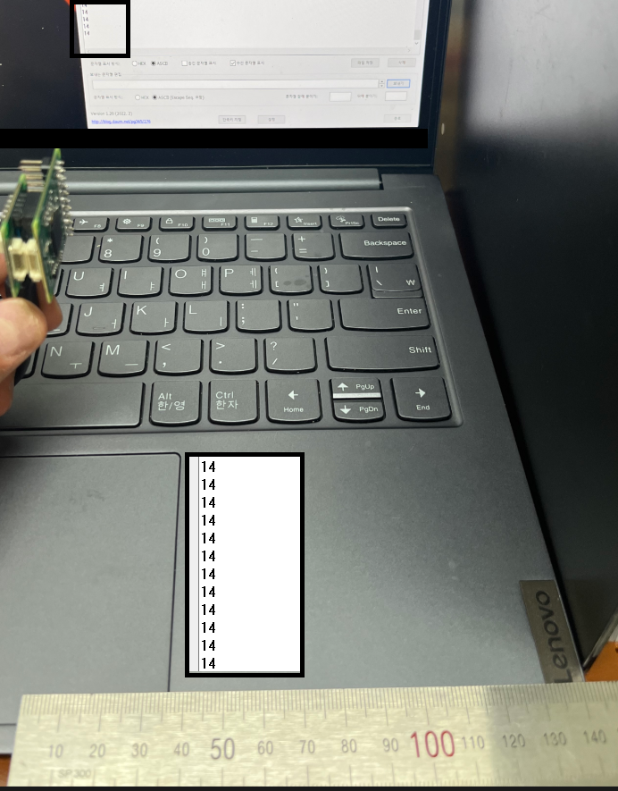
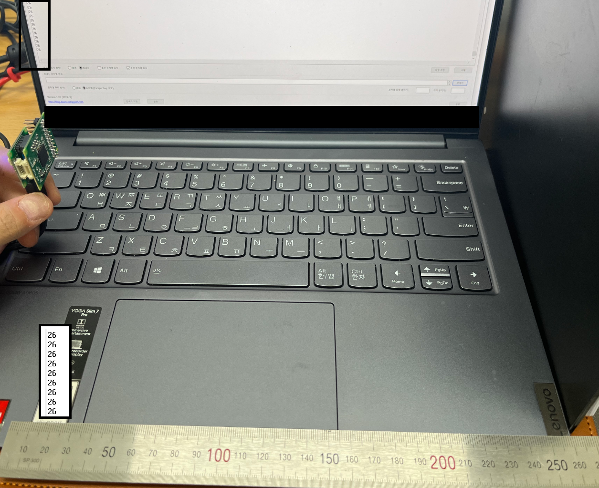

# 24GHz Radar (Socionext)
AT32F413(mcu)과 SC1233(chip)을 사용하여, 24GHz 대역의 Radar를 사용하여 거리를 측정하는 기능을 구현하였습니다.

## 개발환경

프로젝트에 사용된 환경입니다.
- 디바이스 : AT32F413
- 개발환경 : KEIL
- 컴파일러 : KEIL MDK
- 프로그래머 : Artery ISP Programmer_V1.5.30
- 사용언어 : C
- 사용기능 : UART, SPI, GPIO


## 기능 설명

SC1233은 레이더 애플리케이션용으로 특별히 설계되었으며 거리 측정 및 기타 레이더 기반 기능에 적합한 기능을 제공하는데,<br>
프로젝트에서 선택하여 개발한 기능은 `DISTANCE 모드`입니다.<br>
AT32F413은 24GHz 레이더의 컨트롤러 역할을 하는 마이크로컨트롤러 유닛(MCU)입니다.<br>
socionext사의 SC1233을 AT32F413 MCU와 결합하여 거리측정 시스템을 만들었습니다.<br>
<br>
다음은 주요 기능 중 일부입니다.<br>
<br>
1. 레이더 신호 처리<br>
SC1233에는 전용 레이더 신호 처리 기능이 장착되어 있습니다. <br>
24GHz 주파수 대역에서 레이더 신호의 수신 및 처리를 지원하며, 거리 측정, 물체 감지 및 충돌 방지와 같은 단거리 레이더 애플리케이션에 일반적으로 사용됩니다.<br>
<br>
2. 통합환경<br>
레이더 애플리케이션에 필요한 다양한 구성 요소를 단일 칩에 결합하여 고집적 솔루션을 제공합니다.<br>
여기에는 RF(무선 주파수) 프런트 엔드, ADC(아날로그-디지털 변환기), DSP(디지털 신호 처리) 장치 및 외부 마이크로 컨트롤러 또는 호스트 시스템과의 통신을 위한 인터페이스가 포함됩니다.<br>
<br>
3. 저전력 소비<br>
Socionext는 저전력 소비에 중점을 두고 SC1233을 설계하여 배터리 구동 장치 및 에너지 효율적인 애플리케이션에 적합합니다.<br>
이 칩은 전력 관리 기술을 통합하여 성능 저하 없이 전력 사용을 최적화합니다.<br>
<br>
4. 유연한 구성 가능성<br>
SC1233은 구성의 유연성을 제공하여 개발자가 특정 애플리케이션 요구 사항에 따라 작동을 사용자 지정할 수 있습니다.<br>
레이더 신호 처리를 위한 프로그래밍 가능한 매개변수를 제공하여 감지 범위, 감도 및 필터링 옵션과 같은 조정을 가능하게 합니다.<br>
<br>
5. 고급 신호 처리<br>
SC1233에는 내장 신호 처리 알고리즘과 레이더 성능을 향상시키는 기능이 포함되어 있습니다.<br>
노이즈 억제 기술, 적응형 필터링 및 고급 감지 알고리즘을 지원하여 거리 측정 및 물체 감지의 정확성과 신뢰성을 향상시킵니다.<br>
<br>
6. 통신 인터페이스<br>
SC1233은 외부 시스템과의 통합을 용이하게 하기 위해 다양한 통신 인터페이스를 제공합니다.<br>
프로젝트에서는 SPI(Serial Peripheral Interface)직렬 통신 인터페이스를 사용하여 마이크로컨트롤러와 연결하여 제어하였습니다.<br>

전반적으로 Socionext SC1233은 24GHz 주파수 대역의 레이더 애플리케이션용으로 설계된 특수 SoC입니다.<br>
통합환경, 저전력 소비, 구성 가능한 기능 및 고급 신호 처리 기능을 통해 자동차, 산업 및 스마트 인프라와 같은 다양한 응용 분야의 거리 측정, 물체 감지 및 충돌 방지 시스템에 매우 적합합니다.<br>
<br>
프로젝트의 24GHz Radar 세부사항 설정은 다음과 같습니다.

**function**|**selection**
:---|:---
Device|SC1233
Mode|Distance measurement
Rx gain|60db
Chirp time|4400us
Interval|25
Lower distance|10
Upper distance|800
Digital beam shaper|Wide
High pass filter|First order
Distance step|Step normal


## Distance Mode의 사용 or 변경법

프로젝트에 사용된 Distance모드는 별도의 수정 없이 USART로 거리데이터가 출력됩니다.<br>
2D, Motion, FIFO 등의 모드를 사용하기 위해서는 모드에 맞는 헤더파일이 필요하며, 설정 및 약간의 코드가 수정이 되어야 합니다.<br>
코드의 간단한 수정으로 Distance Mode의 설정이 가능합니다.<br>

1. main문의 Setting parameters 변경

```yaml
    struct rs_distance_param lp;
            lp.rx_gain = 60;
            lp.interval = 25;
            lp.beta = 205;
            lp.lower_distance = 10;
            lp.upper_distance = 800;
            lp.chirp_time = 4400;
            lp.digital_beam_shaper = RS_DIGITAL_BEAM_SHAPER_WIDE;
            lp.high_pass_filter = RS_HPF_FIRST_ORDER;
            lp.distance_step = RS_DISTANCE_STEP_NORMAL;
            handle.param = &lp;    
```

2. rx_ctl_distance.h의 헤더파일 변경

```yaml
    #include "distance_wide/distance_wide_fine_60db_4400us.h"
```

3. 다른 모드의 헤더파일이 필요하시면 언제든지 연락주세요.


## 모듈제작




## 거리 측정 테스트

<br>


## 🔐 Commit Convention
**Tag Name**|**Description**
:---|:---
feat|새로운 기능을 추가
fix|버그 수정
design|CSS 등 사용자 UI 디자인 변경
!breaking change|커다란 API 변경의 경우
!hotfix|급하게 치명적인 버그를 고쳐야하는 경우
style|코드 포맷 변경, 세미 콜론 누락, 코드 수정이 없는 경우
refactor|프로덕션 코드 리팩토링
comment|필요한 주석 추가 및 변경
docs|문서 수정
test|테스트 코드, 리펙토링 테스트 코드 추가, Production Code(실제로 사용하는 코드) 변경 없음
chore|빌드 업무 수정, 패키지 매니저 수정, 패키지 관리자 구성 등 업데이트, Production Code 변경 없음
rename|파일 혹은 폴더명을 수정하거나 옮기는 작업만인 경우
remove|파일을 삭제하는 작업만 수행한 경우

<br/>

## License
(C) 2022 PETABREW. Author : sehwan.park. Version : Ver 0.1
